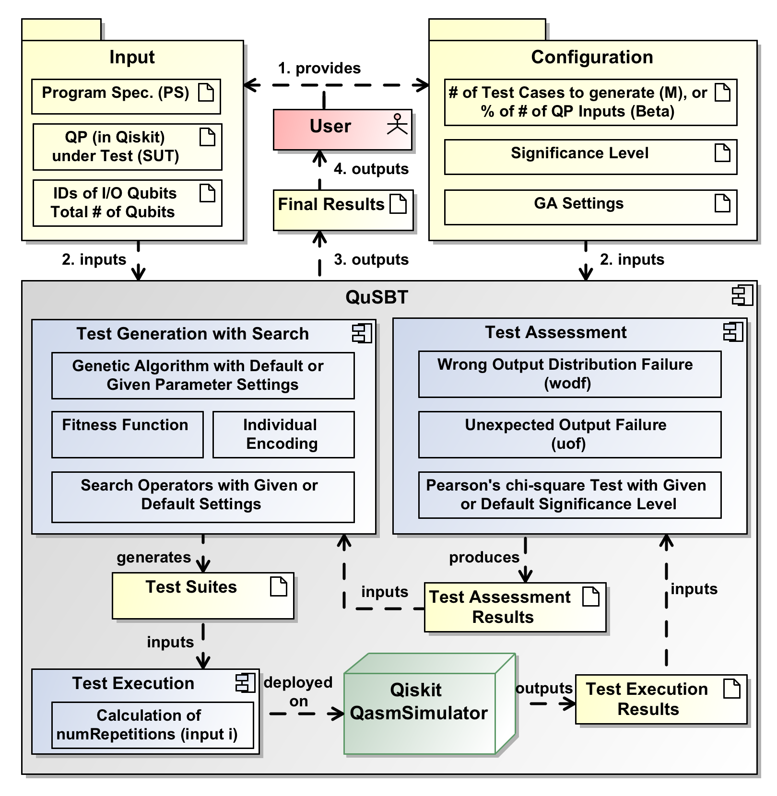

# QuSBT: Search-Based Testing of Quantum Progrms

## Description
Generating a test suite for a quantum program such that it has the maximum number of failing tests is an optimization problem. For such optimization, search-based testing has shown promising results in the context of classical programs. To this end, we present a test generation tool for quantum programs based on a genetic algorithm, called QuSBT (Search-based Testing of Quantum Programs). QuSBT automates the testing of quantum programs, with the aim of finding a test suite having the maximum number of failing test cases. QuSBT utilizes IBM's Qiskit as the simulation framework for quantum programs. We present the tool architecture in addition to the implemented methodology (i.e., the encoding of the search individual, the definition of the fitness function expressing the search problem, and the test assessment w.r.t. two types of failures). Finally, we report results of the experiments in which we tested a set of faulty quantum programs with QuSBT to assess its effectiveness.

## Architecture of QuSBT


<!---
your comment goes here
and here


-->



## Installation

- Clone the current repository
  ```
  git clone https://github.com/qiqihannah/QuSBT.git
  ```
- Install Anaconda. You can download Anaconda for your OS from https://www.anaconda.com/
<!---For example, for macOS
    ```
    wget https://repo.anaconda.com/archive/Anaconda3-5.3.1-MacOSX-x86_64.sh
    bash Anaconda3-5.3.1-MacOSX-x86_64.sh
    ```-->
- Create a conda environment (e.g., with name "qusbt_env"):
   ```
   conda create -n qusbt_env python=3.9
   ```
- Activate the environment and install Qiskit and rpy2
  ```
  conda activate qusbt_env
  pip install qiskit
  pip install rpy2
  pip install openpyxl
  ```

## How to use QuSBT?
### Quantum Program File
- The quantum program should be written with Qiskit.
- The code has to be structured in a function named as 'run' with one parameter that refers to the quantum circuit.
- Users only need to add gates to the circuit and measure output qubits to get the output. They don't need to set any register, initialize circuits, choose the simulation, or execute the circuits in 'run' function.

###Program Specification
For each input, there should be one or more than one outputs. The probability of occurrence of one output can be shown as a decimal with binary numbers of input-output pair, and the input and the output are separated by a comma. 

Here is one simple example:
```
00,1=0.5
00,0=0.5
01,1=0.5
01,0=0.5
```
Specially, the dash symbol '-' represents both '0' and '1' for inputs and outputs, which means the example above can be expressed as below:

```
0-,-=0.5
```


### Configuration File
The configuration file should be written in an INI file.
The configuration file is described below.
```
[program]
root=
;(Required)
;Description: The absolute root of your quantum program file.
num_qubit=
;(Required)
;Description: The total number of qubit of your quantum program.
inputID=
;(Required)
;Description: The IDs of input qubits.
;Format: A non-repeating sequence separated by commas.
outputID=
;(Required)
;Description: The IDs of output qubits which are the qubits to be measured.
;Format: A non-repeating sequence separated by commas.


[qusbt_configuration]
beta=
;(Optional)
;Description: The percentage of possible inputs as the number of test cases in a test suite.
M=
;(Optional)
;Description: The number of test cases in a test suite.
;Attention: You should use either 'beta' or 'M'. We use 'beta' as 0.05 by default.


[GA_parameter]
population_size=
;(Optional)
;Description: The population size in GA, population_size=10 by default.
offspring_population_size=
;(Optional)
;Description: The offspring population size in GA, offspring_population_size=10 by default.
max_evaluations=
;(Optional)
;Description: The maximum evaluations in GA, max_evaluations=500 by default.
mutation_probability=
;(Optional)
;Description: mutation probability in GA, mutation_probability=1.0/M, 'M' is the size of a test suite by default.
mutation_distribution_index=
;(Optional)
;Description: mutation distribution in GA, mutation_distribution_index=20 by default.
crossover_probability=
;(Optional)
;Description: crossover probability in GA, crossover_probability=0.9 by default.
crossover_distribution_index=
;(Optional)
;Description: crossover probability in GA, crossover_distribution_index=20 by default.


[program_specification]
;Description: The program specification.
;Format:input string (binary),output string (binary)=probability
;Example:
;00,1=0.5
;00,0=0.5
;01,1=0.5
;01,0=0.5
;or
;0-,-=0.5
;Attention: '-' can refer to both '0' and '1'.
```

### Command Line Operation

First, you need to activate the conda environment:
   ```
   conda activate qusbt_env
   ```

Second, you can start the program (from the repository root) as follows:
   ```
   python QuSBT_Tool/main.py
   ```
   
Third, you can enter a number to select your operation.
```
1. Check the template of the configuration file.(.ini file)

2. Check the example of the configuration file.(.ini file)

3. Upload your configuration.(.ini file)

4. Exit.
```

If you enter '3', QuSBT will guide you to enter the absolute root of your configuration(.ini) file.
```
please enter the root of your configuration file.(.ini file)
```
QuSBT will generate test cases according to the coverage criterion and execute to get results.

QuSBT will assess the results according to the two test oracles that have been proposed in <a href="https://link.springer.com/chapter/10.1007/978-3-030-88106-1_2">this paper</a>:
- uof: Whether an observed output is correct according to program specification. If not, the program is failed;
- wodf: If all the observed outputs corresponding to an input are valid, then it compares their observed probabilities with the ones specified in the Program Specification file. If the differences are statistically significant (i.e., a p-value lower than the chosen significance level), the program is failed.

After running, you get 2 files (one excel file and one python script file). They contain
- Excel file with solution and log information
- Unit testing file of solution

## Video Demonstration
A video demo is available <a href="https://youtu.be/3apRCtluAn4" target=_blank>here</a>.

## Experimental Data
Experimental data including quantum programs, and program specifications can be downloaded <a href="Experiment">here</a>.

## Extension
One can checkout the code from GitHub and provide extensions to QuSBT.


## Paper
X. Wang, P. Arcaini, T. Yue, S. Ali. QuSBT: Search-Based Testing of Quantum Programs. In 2022 IEEE/ACM 44th International Conference on Software Engineering: Companion Proceedings (ICSE-Companion) [[doi](https://doi.org/10.1109/ICSE-Companion55297.2022.9793826)]
